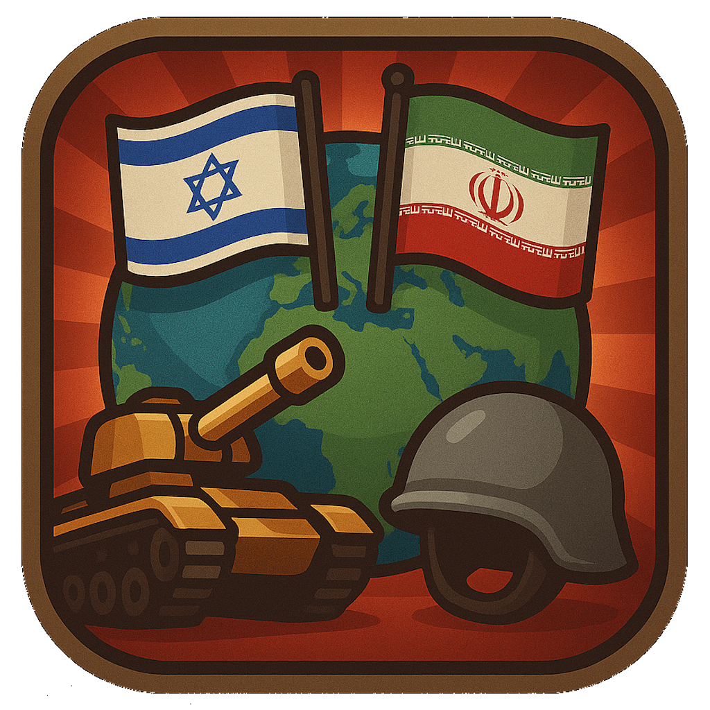

# NBW - New Big War 🚀⚔️

<div align="center">
  
  
  ### Community Sentiment Tracker
  
  [](https://nextjs.org/)
  [](https://www.typescriptlang.org/)
  [](https://tailwindcss.com/)
  [](https://solana.com/)
  [](LICENSE)
</div>

---

## 🌟 Overview

**NBW (New Big War)** is a revolutionary sentiment measurement platform that transforms community support tracking into an epic and visually stunning experience. Two real tokens on Solana blockchain - **Israel** and **Iran** - compete for community sentiment through actual liquidity and trading volume.

### 🎯 Key Features

- **Real-time Sentiment Tracking** 📊
- **Beautiful Animated UI** ✨
- **Community Support Measurement** 🏆
- **Solana Blockchain Integration** ⚡
- **Responsive Design** 📱
- **PWA Support** 📲
- **Social Media Optimization** 📢

## 🚀 Live Demo

Visit the live application: **[NBW - New Big War](https://nbw-war.vercel.app)**

## 🛠️ Tech Stack

- **Framework:** Next.js 14.2.30
- **Language:** TypeScript
- **Styling:** Tailwind CSS
- **Animations:** Framer Motion
- **Icons:** Phosphor Icons + Tabler Icons
- **Blockchain:** Solana
- **Deployment:** Vercel

## 📦 Installation

1. **Clone the repository**
   ```bash
   git clone https://github.com/Kaiojansen/watrrr.git
   cd watrrr
   ```

2. **Install dependencies**
   ```bash
   npm install
   ```

3. **Run the development server**
   ```bash
   npm run dev
   ```

4. **Open your browser**
   Navigate to [http://localhost:3000](http://localhost:3000)

## 🎮 How It Works

### Community Sentiment Tracking
- Users can express support for either **Israel** or **Iran** tokens
- Real-time statistics show community sentiment levels
- Beautiful visual representations of support distribution
- Live price and liquidity tracking

### Token Integration
- **Israel Token:** `CQzT2xDP1hTsruxVUSRXgMBwnH3jgKNNEBHwUdRfpump`
- **Iran Token:** `F7HPUw7BnQzdfUjCUehqjEGjfkqFGGNmUEptHuVDpump`
- Powered by **Pump.fun** platform
- Solana Mainnet integration

## 🎨 Features

### Visual Effects
- ✨ Particle animations with tank images
- 🌟 Glassmorphism design elements
- 🎭 Custom Waruna font integration
- 🎨 Dynamic color schemes
- 📱 Responsive mobile design

### User Experience
- 🎯 Intuitive support buttons
- 📊 Real-time statistics dashboard
- 🏆 Community choice indicators
- ⚡ Fast loading and smooth animations
- 🔄 Auto-refreshing data

## 📱 PWA Features

- **Installable** as a mobile app
- **Offline capable** with service workers
- **App shortcuts** for quick access
- **Splash screens** and icons
- **Native app experience**

## 🌐 Social Media Optimization

- **Open Graph** tags for Facebook/LinkedIn
- **Twitter Cards** for Twitter sharing
- **Structured data** for search engines
- **Meta descriptions** and keywords
- **Favicon** and app icons

## 📊 Project Structure

```
watrrr/
├── app/                    # Next.js App Router
│   ├── globals.css        # Global styles
│   ├── layout.tsx         # Root layout
│   └── page.tsx           # Home page
├── components/            # React components
│   ├── FlagIsrael.tsx     # Israel flag component
│   ├── FlagIran.tsx       # Iran flag component
│   ├── ParticleEffect.tsx # Particle animations
│   ├── SimpleBuyButtons.tsx # Support buttons
│   └── WarBar.tsx         # Sentiment bar
├── hooks/                 # Custom React hooks
│   └── useRealTimeData.ts # Data fetching hook
├── lib/                   # Utility libraries
│   └── solana.ts          # Solana integration
├── public/                # Static assets
│   ├── flags/             # Flag images
│   ├── fonts/             # Custom fonts
│   ├── logo/              # Logo images
│   ├── particles/         # Particle images
│   ├── manifest.json      # PWA manifest
│   └── browserconfig.xml  # Windows tile config
└── package.json           # Dependencies
```

## 🔧 Configuration

### Environment Variables
```env
# Add your environment variables here
NEXT_PUBLIC_SOLANA_RPC_URL=your_rpc_url
NEXT_PUBLIC_JUPITER_API_URL=your_jupiter_api_url
```

### Customization
- **Colors:** Modify `tailwind.config.js`
- **Fonts:** Update `app/globals.css`
- **Animations:** Adjust Framer Motion settings
- **Icons:** Replace with custom icons

## 🚀 Deployment

### Vercel (Recommended)
1. Connect your GitHub repository
2. Configure build settings
3. Deploy automatically on push

### Other Platforms
- **Netlify:** Compatible with Next.js
- **Railway:** Easy deployment
- **DigitalOcean:** App Platform support

## 🤝 Contributing

1. Fork the repository
2. Create a feature branch (`git checkout -b feature/amazing-feature`)
3. Commit your changes (`git commit -m 'Add amazing feature'`)
4. Push to the branch (`git push origin feature/amazing-feature`)
5. Open a Pull Request

## 📄 License

This project is licensed under the MIT License - see the [LICENSE](LICENSE) file for details.

## 🙏 Acknowledgments

- **Solana** for blockchain infrastructure
- **Pump.fun** for token trading platform
- **Next.js** for the amazing framework
- **Tailwind CSS** for beautiful styling
- **Framer Motion** for smooth animations

## 📞 Contact

- **GitHub:** [@Kaiojansen](https://github.com/Kaiojansen)
- **Project:** [NBW - New Big War](https://github.com/Kaiojansen/watrrr)
- **Live Demo:** [https://nbw-war.vercel.app](https://nbw-war.vercel.app)

---

<div align="center">
  <p>Made with ❤️ by the NBW Team</p>
  <p>Join the community sentiment tracker today! 🚀</p>
</div> 